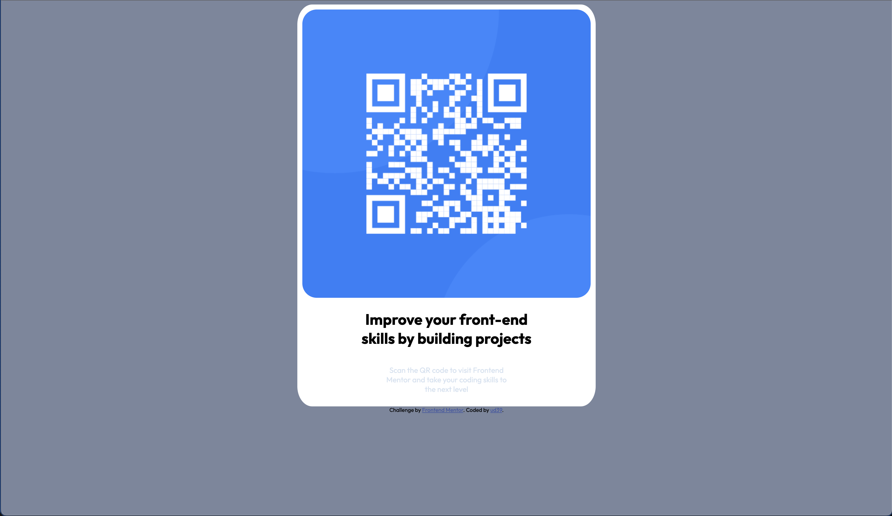
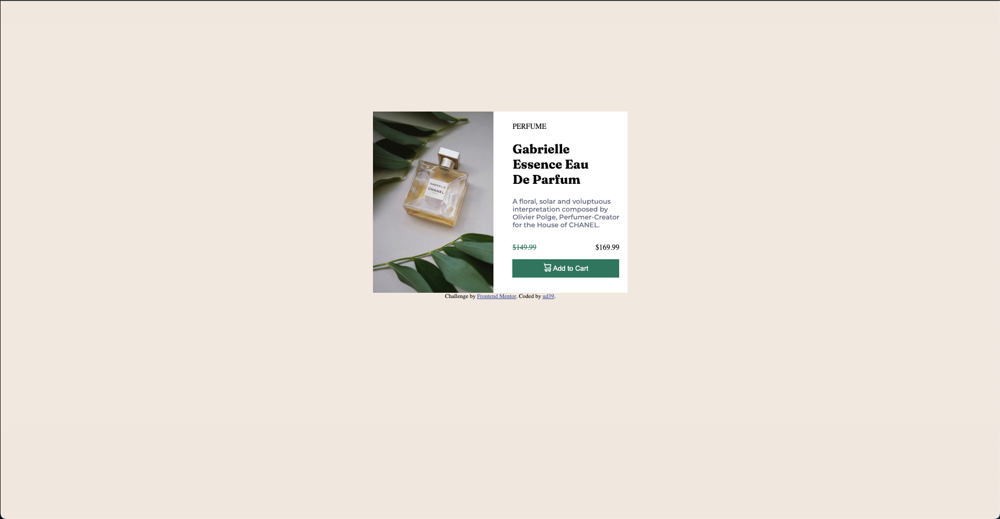
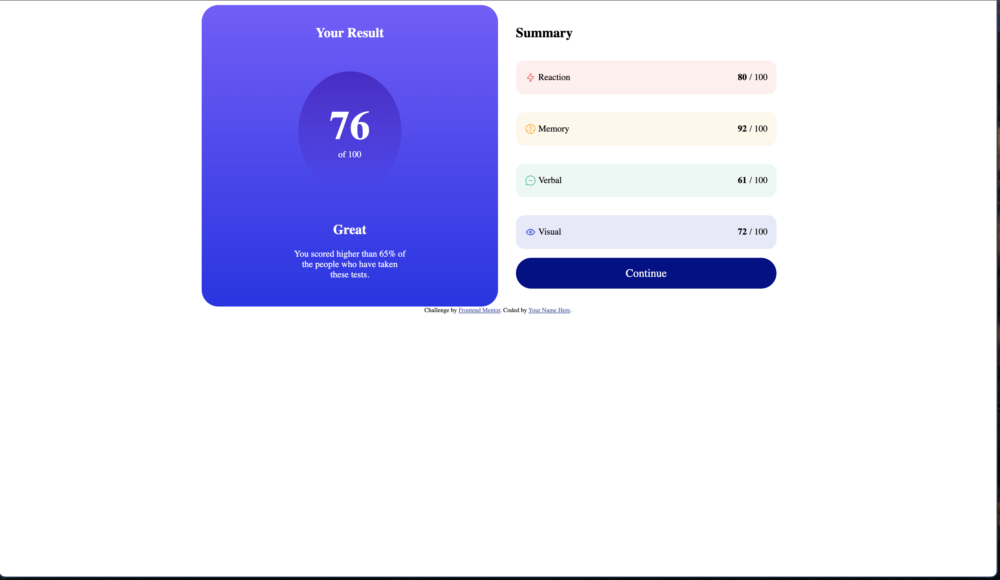
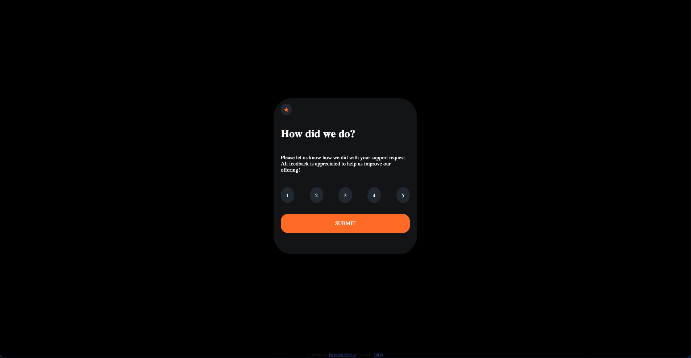
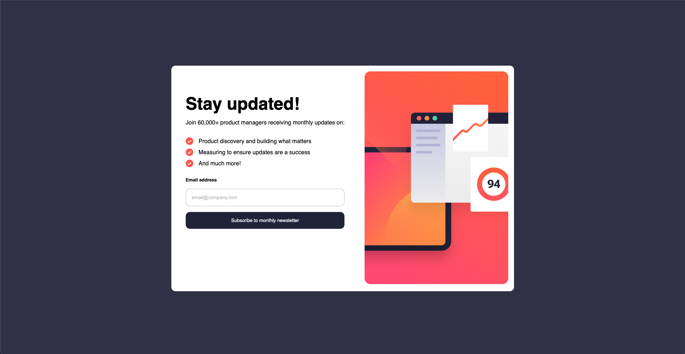

# Challenges from frontendmentor.io solved by me   

This is my repo for front-end mentor challenges  

solutions are being solved using only JavaScript, CSS and semantic HTML. 

## NEWBIE

| Challenge Name       | Preview                                 |
|----------------------|-----------------------------------------|
| [QR-Code](https://ud39.github.io/frontend-mentor/qr-code-component/) |  |
| [Product-Preview](https://ud39.github.io/frontend-mentor/product-preview-card-component/) | |
| [Results-Summary](https://ud39.github.io/frontend-mentor/results-summary-component/) | |
| [Interactive-Rating](https://ud39.github.io/frontend-mentor/interactive-rating-component/) | |

## Junior

| Challenge Name       | Preview                                 |
|----------------------|-----------------------------------------|
| [Newsletter-Sign-Up](https://ud39.github.io/frontend-mentor/newsletter/) |  |
