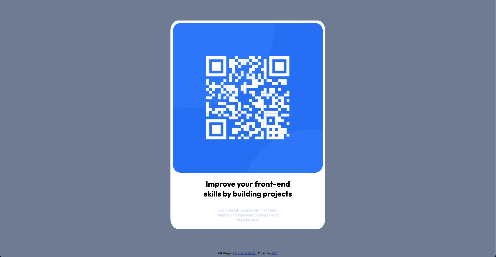
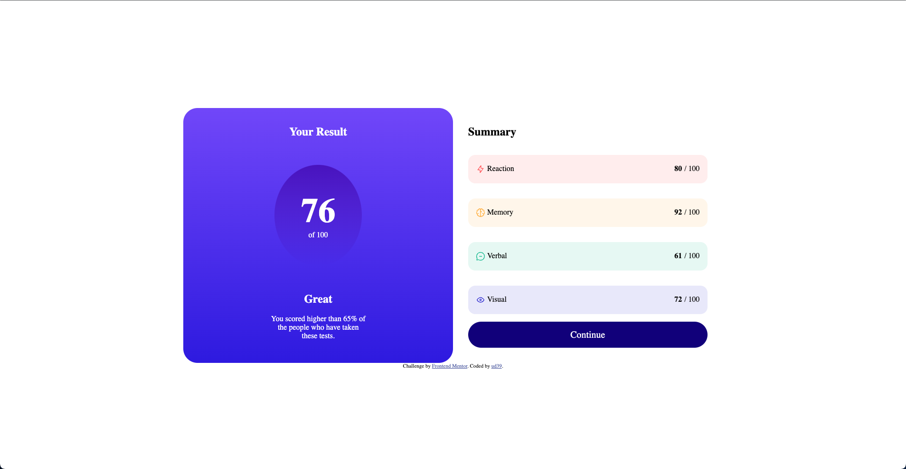
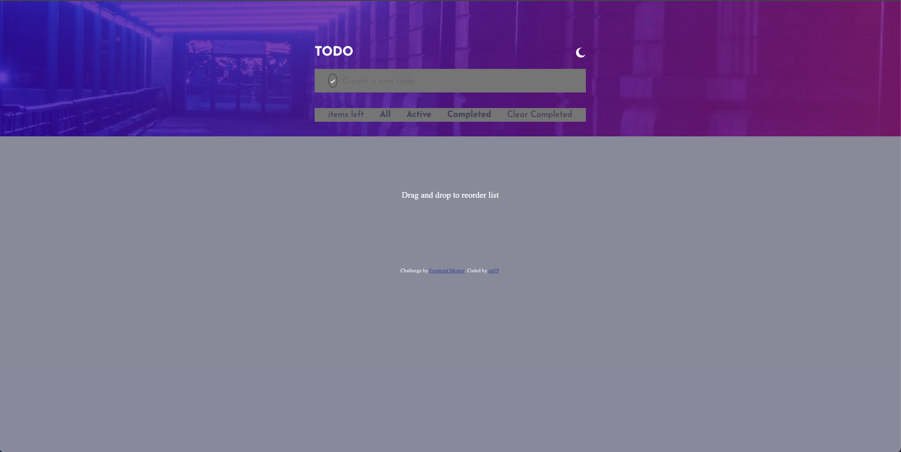

# Challenges from frontendmentor.io solved by me

This is my repository for Frontend Mentor challenges. The solutions are
implemented using only vanilla JavaScript, CSS, and semantic HTML.

It's important to note that the code written here is primarily focused on
achieving the design provided by the challenges. Best practices and additional considerations that would be necessary for real-world implementation are not fully incorporated or not incorporated at all. The following sections explain what is lacking and what should be added if one were to implement these designs in a production application, as well as further explanation of the technologies used.

TL;DR: Best practices I left out due to the size and nature of the
challenges as well as that the focus was only on using vanilla Javascript, CSS and semantic HTHML. [Jump to Questions and Explanations](#questions)

## NEWBIE

| Challenge Name                                                                             | Preview                                                              |
| ------------------------------------------------------------------------------------------ | -------------------------------------------------------------------- |
| [QR-Code](https://ud39.github.io/frontend-mentor/qr-code-component/)                       |              |
| [Product-Preview](https://ud39.github.io/frontend-mentor/product-preview-card-component/)  |        |
| [Results-Summary](https://ud39.github.io/frontend-mentor/results-summary-component/)       |        |
| [Interactive-Rating](https://ud39.github.io/frontend-mentor/interactive-rating-component/) |  |

## Junior

| Challenge Name                                                           | Preview                                                              |
| ------------------------------------------------------------------------ | -------------------------------------------------------------------- |
| [Newsletter-Sign-Up](https://ud39.github.io/frontend-mentor/newsletter/) |  |
| [Age-Calculator](https://ud39.github.io/frontend-mentor/age-calculator/) |          |

## Intermediate

| Challenge Name                                           | Preview                                  |
| -------------------------------------------------------- | ---------------------------------------- |
| [ToDo-App](https://ud39.github.io/frontend-mentor/todo/) |  |

## Questions

### Why are the selectors targeting the html tag directly?

Firstly, I wouldn't recommend targeting HTML tags directly with selectors. It
can cause scalability issues, especially when dealing with larger applications.

When selectors target HTML tags directly, it becomes harder to maintain and
style components consistently. As the application grows, conflicts and
specificity problems can arise, making it challenging to effectively manage the codebase.

Instead, it's better to use more specific selectors like class or ID selectors to target elements within components. I didn't follow this practice here due to the size and complexity of the challenges provided by Frontend Mentor.

### There is no CSS reset?

Without a CSS reset, the chance of components being consistent across different browsers is lowered. Ideally, one should have their own custom reset or use libraries such as Normalize.css or CSS Reset to ensure a consistent baseline style across browsers.

In this repository, I didn't include a CSS reset because the main focus was on achieving the design provided by Frontend Mentor, rather than ensuring
cross-browser consistency.

### Why are there no bundlers being used?

In this repository, I deliberately chose not to use bundlers such as Webpack or Vite. The purpose was to see how I could achieve the design using vanilla
JavaScript, CSS, and HTML without the additional considerations of bundling,
supporting older browsers, or optimizing performance.

Bundlers are commonly used in modern frontend development to bundle and
optimize code, handle dependencies, and enable features like code splitting and hot reloading. However, for these challenges, the focus was on
the design aspect rather than the broader aspects of frontend development.

### Why didn't I use any frameworks?

I chose not to use any frameworks for these Frontend Mentor challenges because I wanted to focus on mastering CSS, JavaScript, and HTML—the fundamental building blocks of web development. While frameworks like Angular, React, and Vue are popular and powerful, I deliberately stuck to the basics for these particular challenges.

It's worth mentioning that the web development landscape is constantly
evolving, and new technologies like HTMX are emerging, which can replace or
enhance JavaScript for specific use cases. Additionally, WebAssembly is gaining traction for running high-performance code in web browsers.

To stay current in the industry, it's important to explore emerging
technologies. While frameworks are valuable and widely used, I encourage
developers to also consider learning at least one popular framework. This
provides a solid foundation while also keeping an eye on new trends and
possibilities in web development.
